## SIMPLE TO-DO APPLICATION ON MERN STACK ##

In this project, we are going to deploy a simple to-do application on the __MERN STACK__ in __AWS CLOUD__.

__MERN__ consists of the following:

* __MongoDB :__ This is a document based, no-SQL database used to store application data in form of document.
* __ExpressJs :__  This is a server side web application framework for Node.js.
  
* __ReactJs :__ This is a frontend framework used to build User Interface (UI) which is based on Javascript.This was developed by Facebook.
* __NodeJs :__ This is a JavaScript runtime environment. It is used to run JavaScript on a machine rather than in a browser.

To continue with this Project, we need to do the following:

* create an account on [AWS](https://aws.amazon.com/). 
* we create an instance (virtual machine) by selecting __“ubuntu server 20.04 LTS”__ from Amazon Machine Image(AMI)(free tier). 
* we select “t2.micro(free tier eligible)” 
* then go to the security group and select “existing security group” review and launch.

How to create an aws free tier account. click [here](https://www.youtube.com/watch?v=xxKuB9kJoYM&list=PLtPuNR8I4TvkwU7Zu0l0G_uwtSUXLckvh&index=7)

This launches us into the instance as shown in the screenshot:

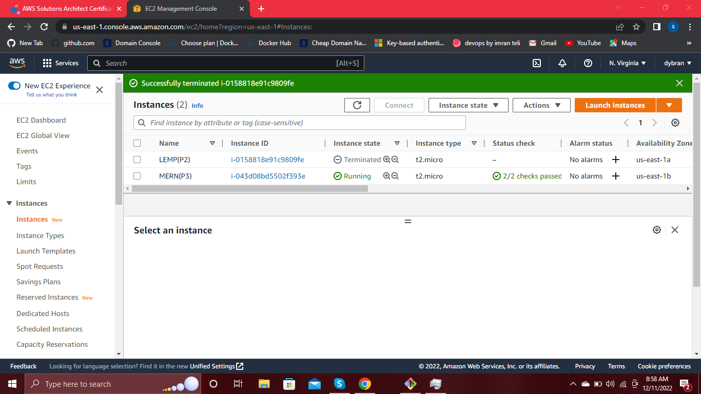

We open our terminal and go to the location of the previously downloaded PEM file:


To know how to download PEM File from __AWS__. Click [here](https://intellipaat.com/community/52119/how-to-download-a-pem-file-from-aws).

We connect to the instance from our ubuntu terminal using the command:

```$ ssh -i dybran-ec2.pem ubuntu@55.221.149.200```

This automatically connects to the instance

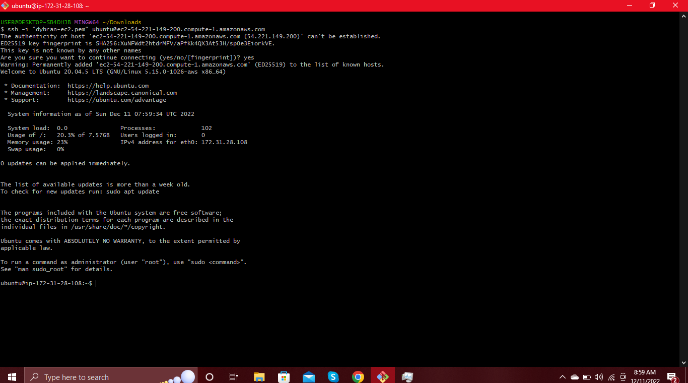

When we are done connecting to the instance, we can proceed with setting up our project.

__BACKEND CONFIGURATION__

We run the commands:

To update Ubuntu.

```$ sudo apt update```

To upgrade Ubuntu

```$ sudo apt upgrade```

Next, we get the location of the __Node.js__ software from the ubuntu repository by  running this command:

```$ curl -fsSL https://deb.nodesource.com/setup_18.x | sudo -E bash -```

After doing the above, we can now install the __Node.js__ and __npm__ by running the command:

```$ sudo apt-get install -y nodejs```

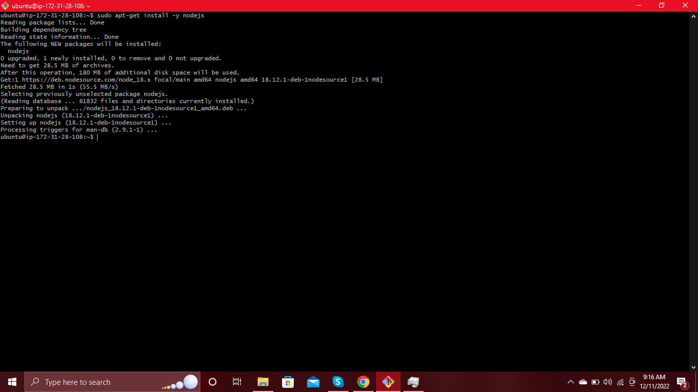

To check the version the __node__:

```$ node -v```

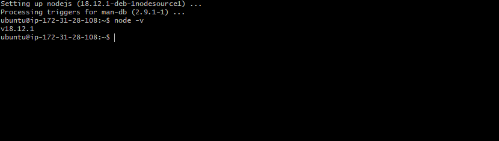

To check the version fo the __npm__:

```$ npm -v```

Next we create a directory for our __To-Do Project__:

```$ mkdir Todo```

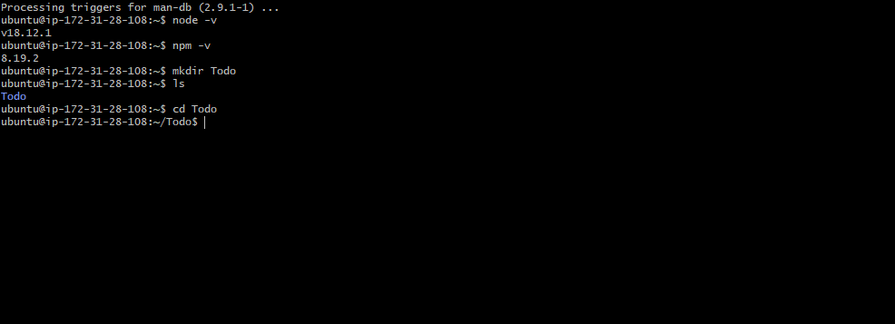

We run the _ls_ command to verify that the directory was created:

```$ ls```

Change into the newly created directory:

```$ cd Todo```

Next, we initialize the project so that a new file __package.json__ will be created. This file contains information of the application and the dependencies it nedds to run.

We initialize the project by running the command:

```$ npm init```

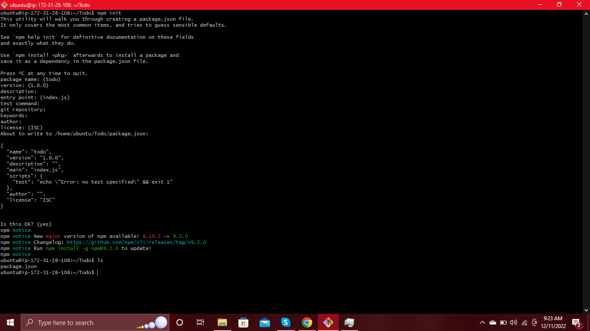

We run the _ls_ command to verify that __package.json__ was created

```$ ls```

Next we install __ExpresJs__ and create the __Routes__ directory.

__INSTALL EXPRESSJS__

__Express__ is a framework for __NodeJs__ Express helps to define routes of your application based on HTTP methods and URLs.

To use __Express__, we install it using __npm__:

```$ npm install express```

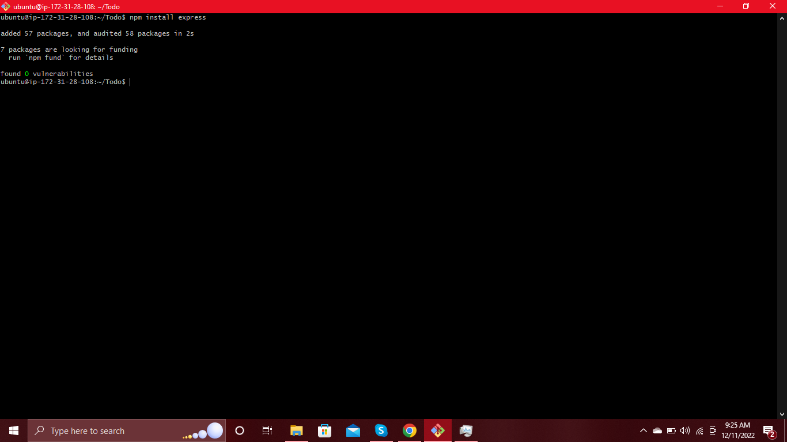

Now create a file __index.js__ using the command:

```$ touch index.js```

We run _ls_ to confirm that the __index.js__ file is successfully created.

Next, install the __dotenv__ module by running the command:

```$ npm install dotenv```

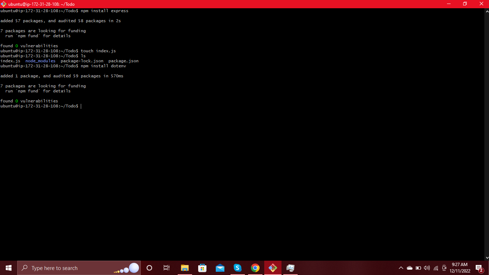

Open the __index.js__ file by running the command:

```$ vim index.js```

We copy the folowing into it and __"save"__ using __":wq"__

```
const express = require('express');
require('dotenv').config();

const app = express();

const port = process.env.PORT || 5000;

app.use((req, res, next) => {
res.header("Access-Control-Allow-Origin", "\*");
res.header("Access-Control-Allow-Headers", "Origin, X-Requested-With, Content-Type, Accept");
next();
});

app.use((req, res, next) => {
res.send('Welcome to Express');
});

app.listen(port, () => {
console.log(`Server running on port ${port}`)
});
```
We start our server to see if it works. Before we start the server, we need to be sure we are in the __Todo__ directory.

```$ node index.js```

If there are no erros, we should see __""Server running on port 5000"__ in your terminal.

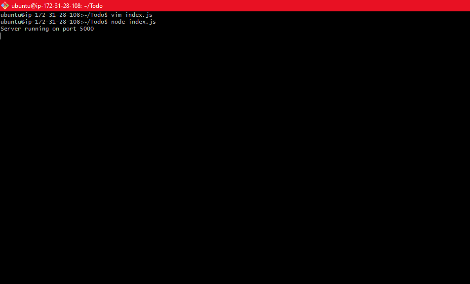

We need to go to our instance security group and edit inbound rules and __add rules__

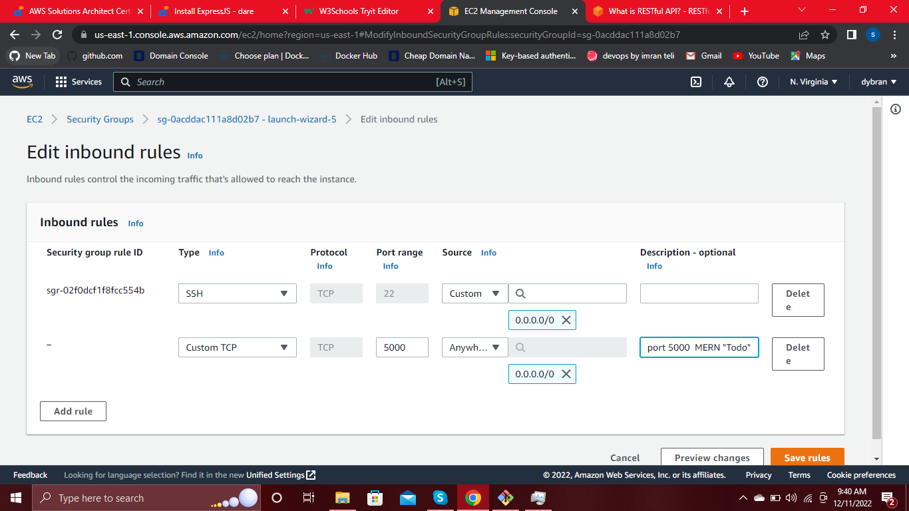

We open our browser and put in the URL

```http://<PublicIP>:5000```

We should see __"welcome to Express"__

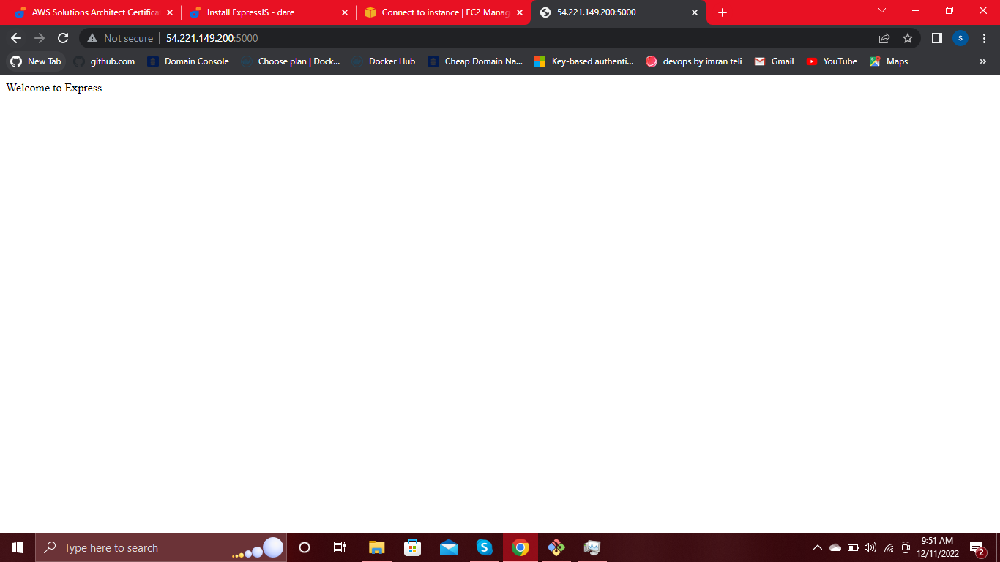

Our __To-Do__ application should be able to do the following:

* create a new task.
* dislay the lists of tasks.
* delcte acompleted task.

We need to create __routes__ that will define various endpoints that the __To-do__ application will depend on.

To create a folder __routes__, we run the command:

```$ mkdir routes```

Change into the __routes__ directory

```$ cd routes```


Now, create a file __api.js__ with the command:

```$ touch api.js```


Open the file

```$ vim api.js```

We then copy and paste the code below into the __api.js__ file

```
const express = require ('express');
const router = express.Router();

router.get('/todos', (req, res, next) => {

});

router.post('/todos', (req, res, next) => {

});

router.delete('/todos/:id', (req, res, next) => {

})

module.exports = router;
```

__"save"__ and __"quit"__ using __":wq"__

__CREATING MODELS__

We then go ahead to create __"Models"__ since the application will be using __MongoDB__ which is a noSQL database. A __Model__ makes the javascript application interactive.
We also use __Models__ to define the database schema . This is important so that we will be able to define the fields stored in each Mongodb document.

The Schema shows how the database will be setup, including other data fields that may not be required to be stored in the database.

To create a Schema and a model, we  will need to install mongoose which is a __Node.js__ package that makes working with mongodb easier.

To install __Mongoose__, we make sure we are in the __Todo__ directory then run the command:

```$ npm install mongoose```

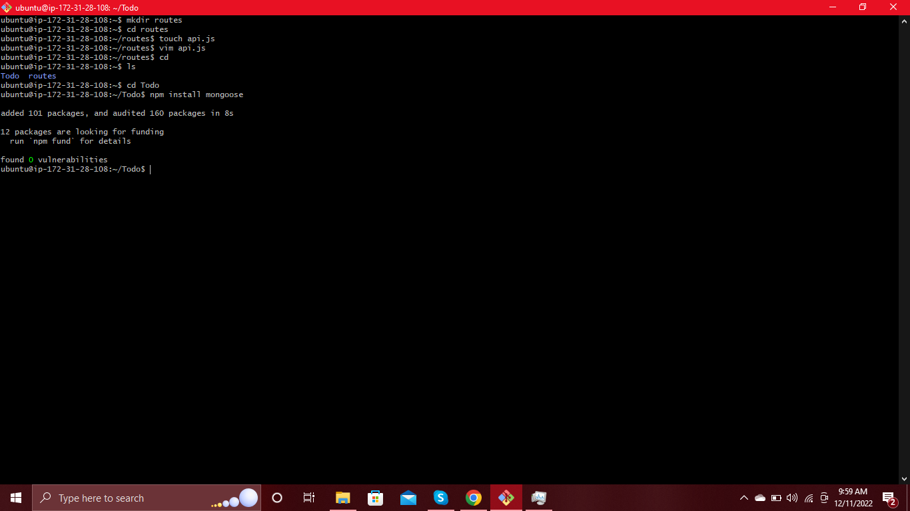

We go ahead to create a folder __models__ by running the command:

```$ mkdir models```

Then we chaneg into the model directory:

```$ cd models```

Inside the __models__ folder, create a file named __todo.js__

```$ touch todo.js```

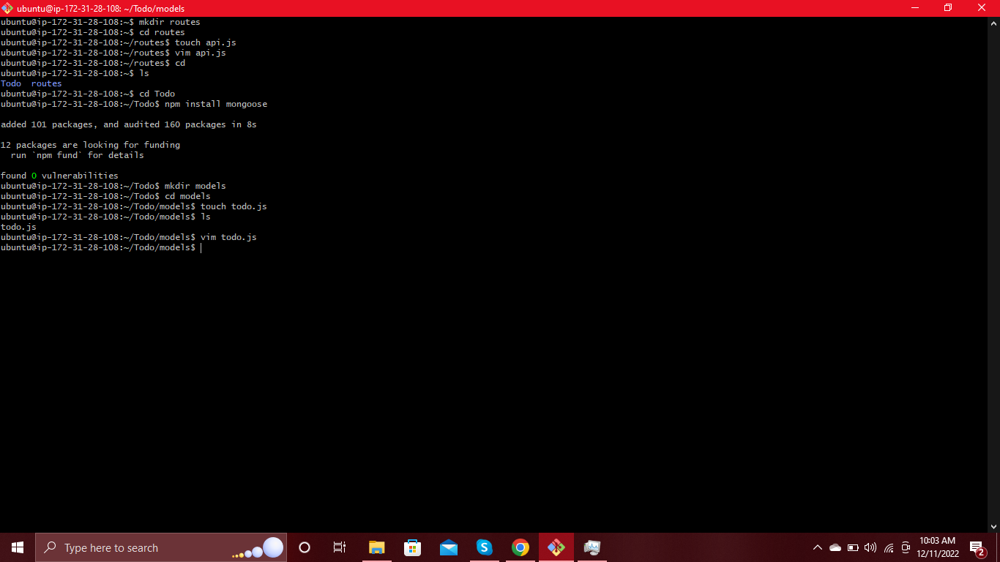

We then open the file and paste the following codes:

```
const mongoose = require('mongoose');
const Schema = mongoose.Schema;

//create schema for todo
const TodoSchema = new Schema({
action: {
type: String,
required: [true, 'The todo text field is required']
}
})

//create model for todo
const Todo = mongoose.model('todo', TodoSchema);

module.exports = Todo;
```

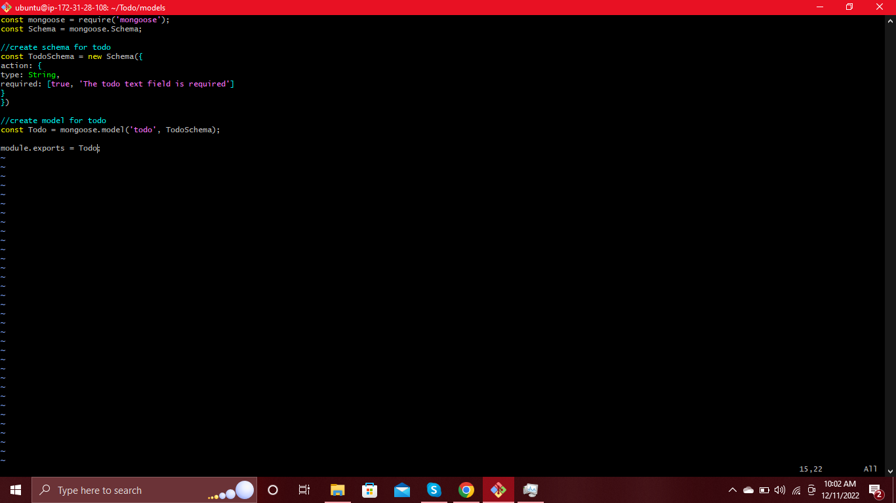

We then go to our __routes__ directory and update the __api.js__ file to be able to make use of the new model.

```$ cd routes```


Open the __api.js__ file

```$ vim api.js```

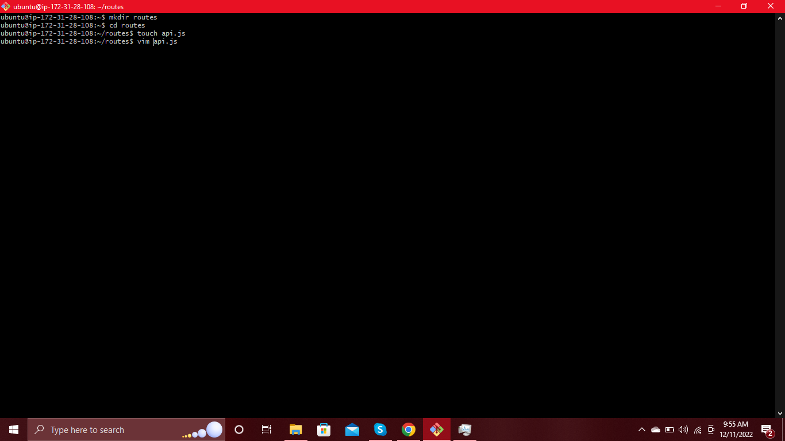

We copy and paste the following codes into the file:

```
const express = require ('express');
const router = express.Router();
const Todo = require('../models/todo');

router.get('/todos', (req, res, next) => {

//this will return all the data, exposing only the id and action field to the client
Todo.find({}, 'action')
.then(data => res.json(data))
.catch(next)
});

router.post('/todos', (req, res, next) => {
if(req.body.action){
Todo.create(req.body)
.then(data => res.json(data))
.catch(next)
}else {
res.json({
error: "The input field is empty"
})
}
});

router.delete('/todos/:id', (req, res, next) => {
Todo.findOneAndDelete({"_id": req.params.id})
.then(data => res.json(data))
.catch(next)
})

module.exports = router;
```

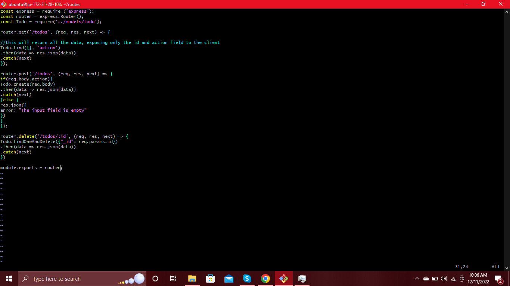

Next we setup the __MongoDB__ Database.

__SETTING UP THE MONGODB DATABASE__

We use __MongoDB__  Database to store our data using __mLab__ which provides __Database as a service (DBaas)__ solution.

To continue, we sign up [here](https://www.mongodb.com/atlas-signup-from-mlab).

Follow the sign up process, select __AWS__ as the cloud provider, and choose a region near you.

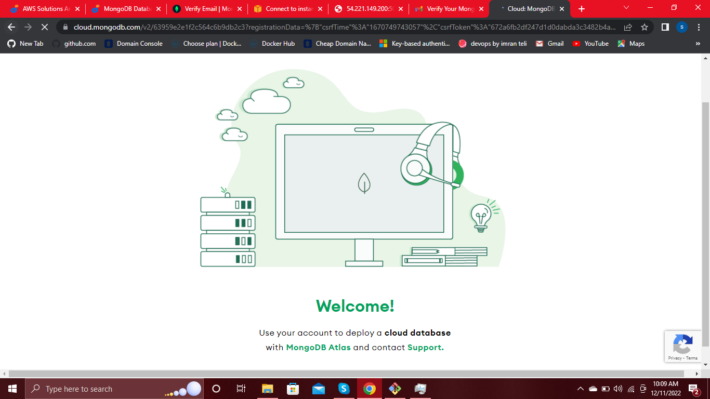

Go to __"Network access"__, select __"Allow access from anywhere"__. This is not secure but good for testing purposes.

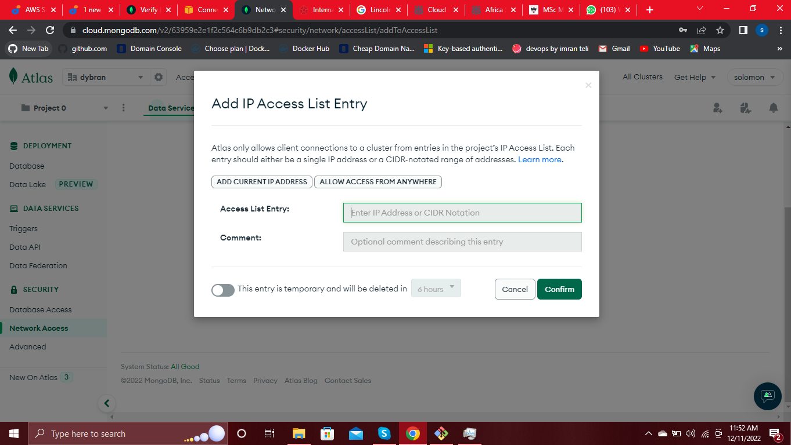

Then change the time of deleting the entry from 6 Hours to 1 Week.

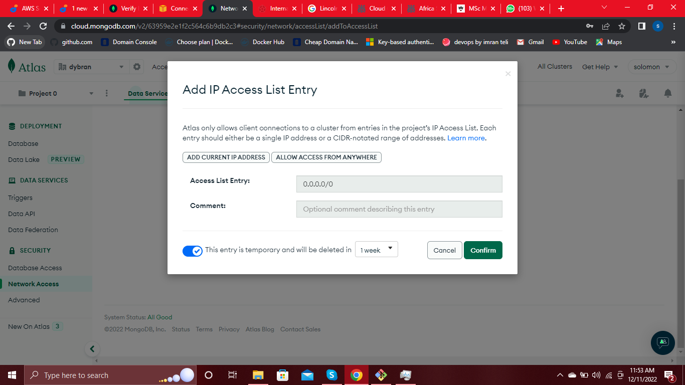

Create a __MongoDB__ database and collection inside __mLab__ by clicking on __"database"__, click on __"cluster0"__ and then open __"collections"__.

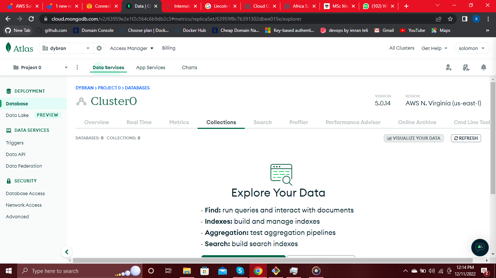

In the __index.js__ file, we specified __process.env__ to access environment variables, but we are yet to create this file.

To create the __process.env__ file, we creta a file in __Todo__ directory and name it __.env__.

```$ touch .env```

Open the file 

```$ vim .env```

Add the connection string to access the database in it, just as below:

```DB = 'mongodb+srv://<username>:<password>@<network-address>/<dbname>?retryWrites=true&w=majority'```

Make sure to update __"<username, <password, <network-address"__ and __<database__ according to your setup.

To get the connection string, we click on __"cluster0"__ then click on __"connect"__

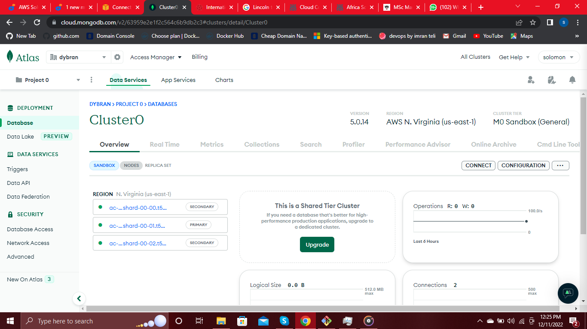

Then we click on __"Mongodb drivers-connect your application..."__

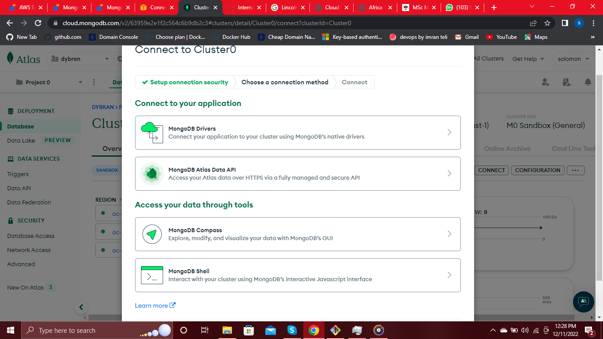

We then copy then connection string displayed into the __.env__ file.

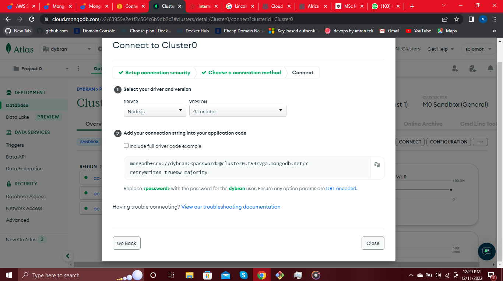                
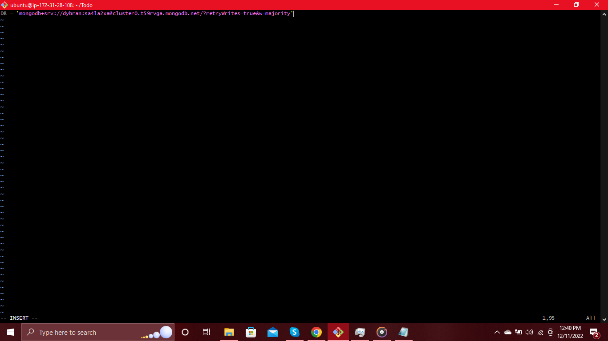

 We need to update the __index.js__ to reflect the use of __.env__ so that __Node.js__ can connect to the database.

 To do that we open the __index.js__ file and delete the content using __"esc"__ then __":%d"__ then __"enter"__. 

 We then replace then content with the following codes:

 ```
 const express = require('express');
const bodyParser = require('body-parser');
const mongoose = require('mongoose');
const routes = require('./routes/api');
const path = require('path');
require('dotenv').config();

const app = express();

const port = process.env.PORT || 5000;

//connect to the database
mongoose.connect(process.env.DB, { useNewUrlParser: true, useUnifiedTopology: true })
.then(() => console.log(`Database connected successfully`))
.catch(err => console.log(err));

//since mongoose promise is depreciated, we overide it with node's promise
mongoose.Promise = global.Promise;

app.use((req, res, next) => {
res.header("Access-Control-Allow-Origin", "\*");
res.header("Access-Control-Allow-Headers", "Origin, X-Requested-With, Content-Type, Accept");
next();
});

app.use(bodyParser.json());

app.use('/api', routes);

app.use((err, req, res, next) => {
console.log(err);
next();
});

app.listen(port, () => {
console.log(`Server running on port ${port}`)
});
```
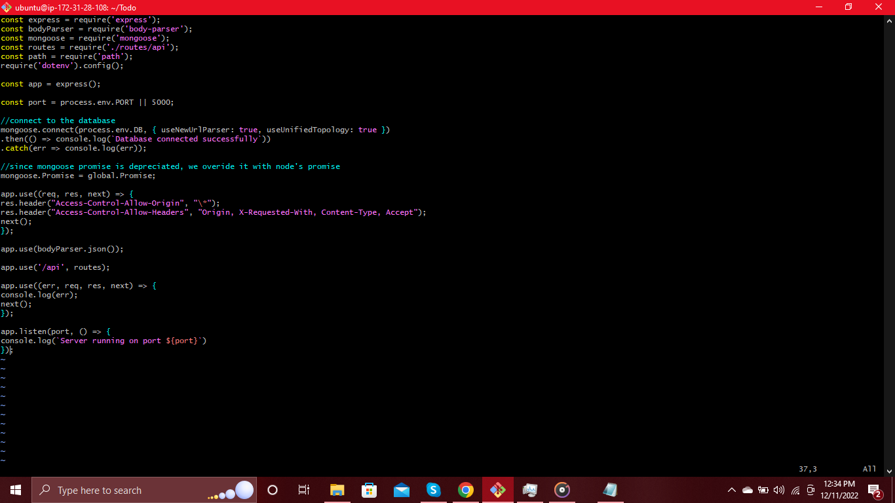

It is more secure to use environment variables to store information so as to separate configuration and secret data from the application, instead of writing connection strings directly inside the __index.js__ application file.

We start our server by running the command:

```$ node index.js```

If the setup has no errors, we should see __" Database connected successfully"__.

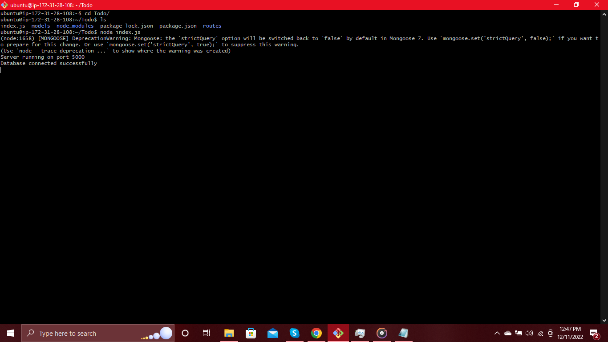

We now have our backend configured, but we need to test it.

To test the backend without the frontend we are going to be using __Restful API__ with the help of an _API_ development client __Postman__.

To download and install __Postman__, click [here](https://www.postman.com/downloads/).

Click [here](https://www.youtube.com/watch?v=FjgYtQK_zLE) to learn how to perform [CRUD Operations](https://en.wikipedia.org/wiki/Create,_read,_update_and_delete) on Postman.

We test all the API endpoints and make sure they are working. For the endpoints that require body, you should send JSON back with the necessary fields since it’s what we setup in our code.

Now open your Postman, create a POST request to the API

 ```http://<PublicIP>:5000/api/todos```.
 
  This request sends a new task to our __To-Do__ list so the application could store it in the database.

 Make sure to set the header __"content-type"__ and __"application/json"__:

 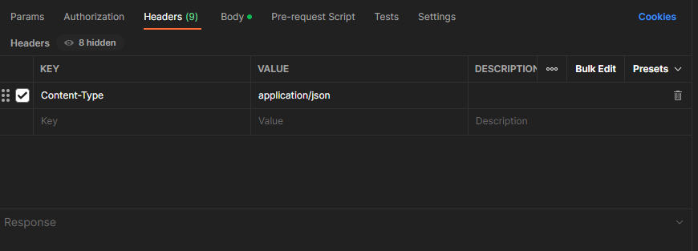

 Then click on __body__. In the field below we key in a command that displays as a response on then next field with an __id__.

 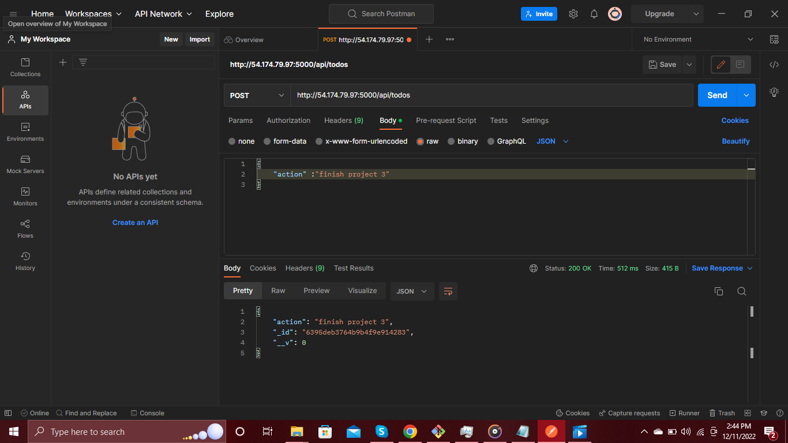

 Create a __GET__ request to your API on 
 
 ```http://<PublicIP>:5000/api/todos```.
 
  This request retrieves all existing records from out To-do application. The backend requests these records from the database and sends it us back as a response to __GET__ request.

  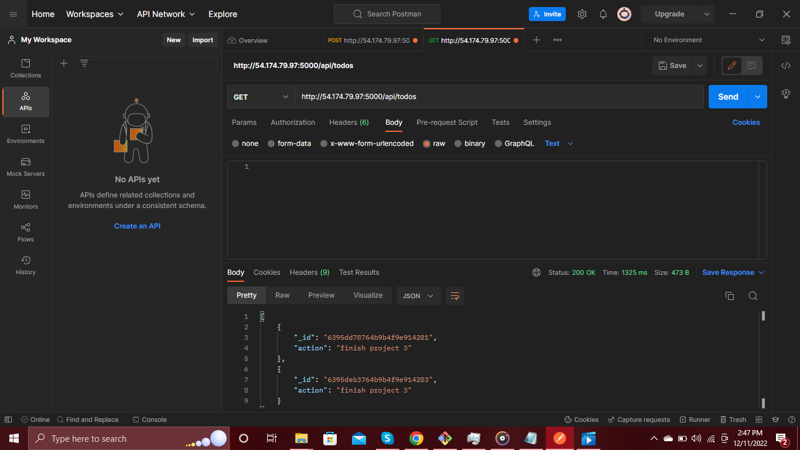

  To delete a task – you need to send its ID as a part of __DELETE__ request.

By now you have tested backend part of our To-Do application and have made sure that it supports all three operations we wanted:

* Display a list of tasks – HTTP GET request
* Add a new task to the list – HTTP POST request
* Delete an existing task from the list – HTTP DELETE request

We have successfully created our Backend, now let go create the Frontend.

__SETTING UP THE FRONTEND__

We will create a user interface for a Web client (browser) to interact with the application via API.

To do this, we will start by running the command in the __Todo__ directory:

```$  npx create-react-app client```

This will create a new folder in your Todo directory called client, where you will add all the react code.

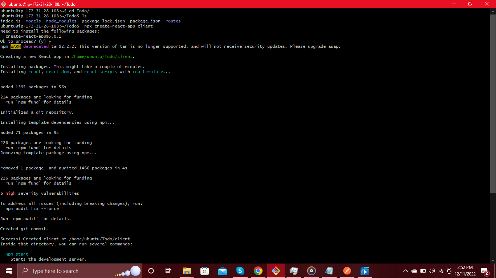

__Running a React Application__

There are some dependencies that need to be installed before running the __React App__.

We Install __"concurrently"__ by running the command:

```$ npm install concurrently --save-dev```

 It is used to run more than one command simultaneously from the same terminal window.

 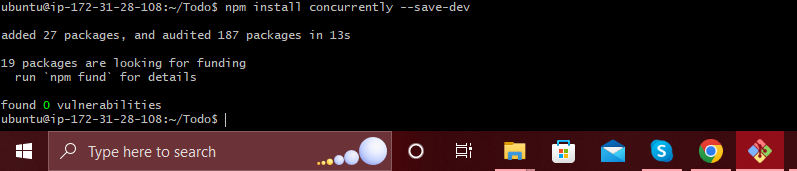

 Next, we install __"nodemon"__. This is used to run and monitor the server. If there is any change in the server code, nodemon will restart it automatically and load the new changes.

 ```$ npm install nodemon --save-dev```

 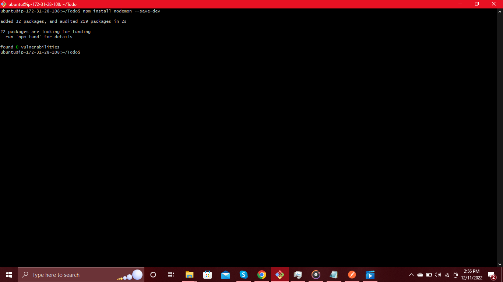

 Goto the _Todo_ directory, open the __package.json__ file.

 ```$ vim package.json```

 In this file, replace the __"scripts"__ section with the following code:

 ```
 "scripts": {
"start": "node index.js",
"start-watch": "nodemon index.js",
"dev": "concurrently \"npm run start-watch\" \"cd client && npm start\""
},
```
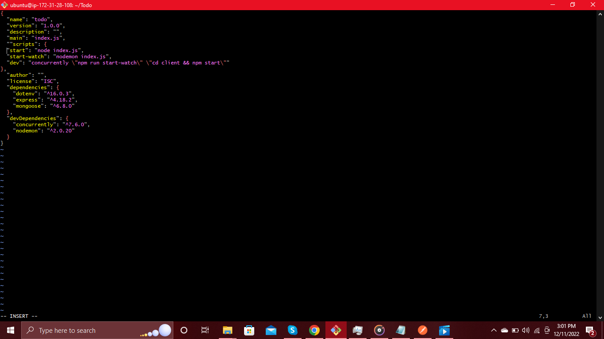

Change into the __client__ directory:

```$ cd client```

Open __package.json__ file:

```$ vim apckage.json```

Add the key value pair in the package.json file 

```"proxy": "http://localhost:5000"```

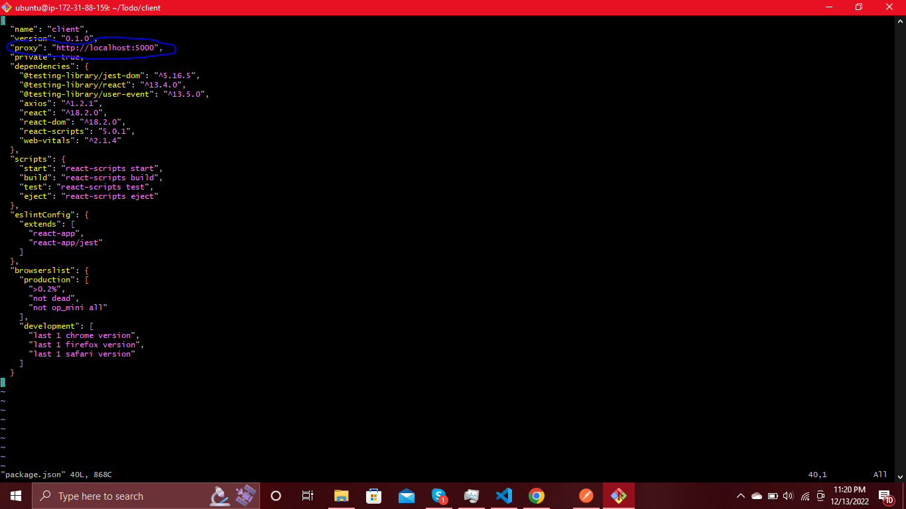

The aim of adding the proxy to the file is to make it possible to access the application directly from the browser by simply calling the server url like __http://localhost:5000__ rather than always including the entire path like __http://localhost:5000/api/todos__.

We go back to the __Todo__ directory:

```$ cd ..``` 

Then run the command:

```$ npm run dev```

The app should open and start running on __localhost:3000__.

In order to be able to access the application from the Internet you have to open __TCP port 3000__ on EC2 by adding a new Security Group rule. The same way the security group for __TCP port 5000__ was created.
This is done by clicking __edit inbound__ rules.


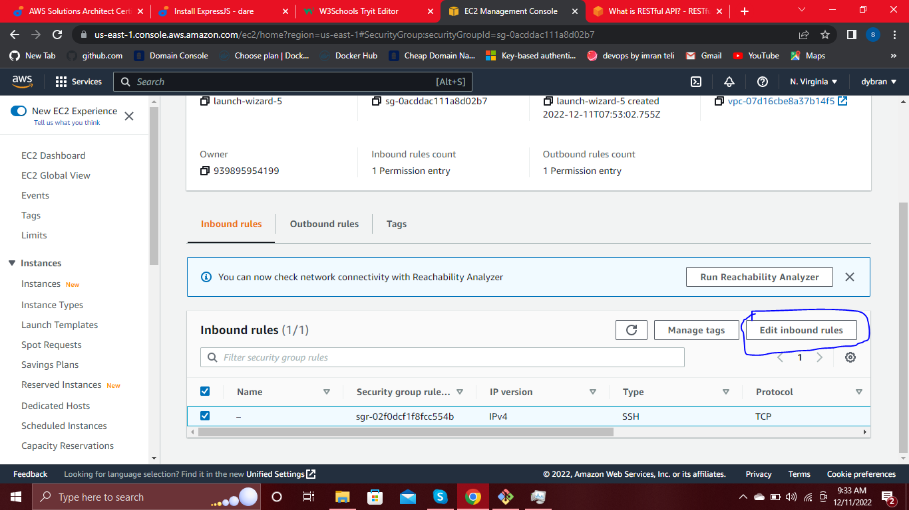

__Creating your React Components__

One of the advantages of react is that it makes use of components, which are reusable and also makes code modular.

Our __Todo__ app will have two stateful components and one stateless component.


Go to __Todo__ directory run the command:

```$ cd client```

Change  into the __src__ directory

```$ cd src```

Inside your src folder create another folder called components

```$ mkdir components```

Move into the __components__ directory:

```$ cd components```


Inside __components__ directory create three files __Input.js, ListTodo.js and Todo.js__.

```$ touch Input.js ListTodo.js Todo.js```

This creates the three files at the same time.

Open Input.js file

```$ vim Input.js```

Copy and paste the following:

```
import React, { Component } from 'react';
import axios from 'axios';

class Input extends Component {

state = {
action: ""
}

addTodo = () => {
const task = {action: this.state.action}

    if(task.action && task.action.length > 0){
      axios.post('/api/todos', task)
        .then(res => {
          if(res.data){
            this.props.getTodos();
            this.setState({action: ""})
          }
        })
        .catch(err => console.log(err))
    }else {
      console.log('input field required')
    }

}

handleChange = (e) => {
this.setState({
action: e.target.value
})
}

render() {
let { action } = this.state;
return (
<div>
<input type="text" onChange={this.handleChange} value={action} />
<button onClick={this.addTodo}>add todo</button>
</div>
)
}
}

export default Input
```

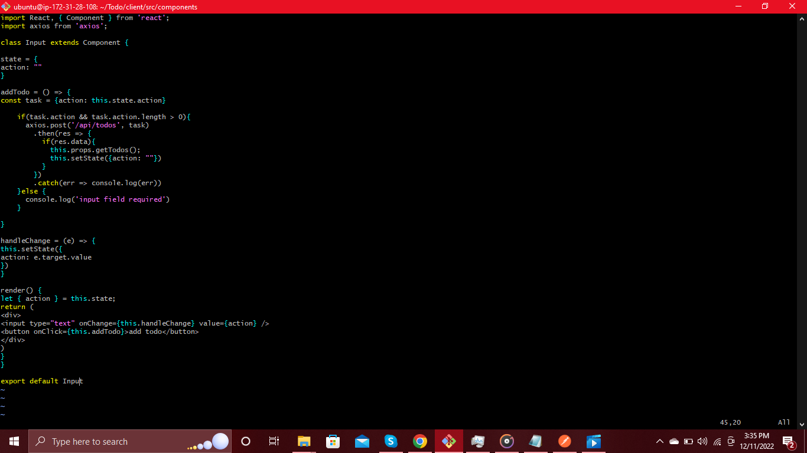

To make use of __Axios__, which is a Promise based HTTP client for the browser and __node.js__.

We go into the __client__ directory and run the command:

```$ cd ../..```

Then run the command:

```$ npm install axios```

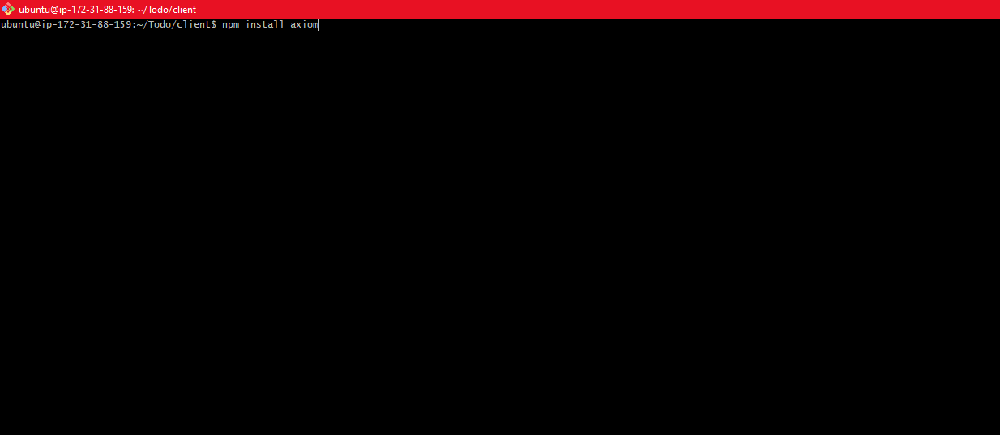

We go to ‘__components__ directory:

```$ cd src/components```


After that we open the __ListTodo.js__

```$ vim ListTodo.js```

In the __ListTodo.js__ copy and paste the following codes:

```
import React from 'react';

const ListTodo = ({ todos, deleteTodo }) => {

return (
<ul>
{
todos &&
todos.length > 0 ?
(
todos.map(todo => {
return (
<li key={todo._id} onClick={() => deleteTodo(todo._id)}>{todo.action}</li>
)
})
)
:
(
<li>No todo(s) left</li>
)
}
</ul>
)
}

export default ListTodo
```
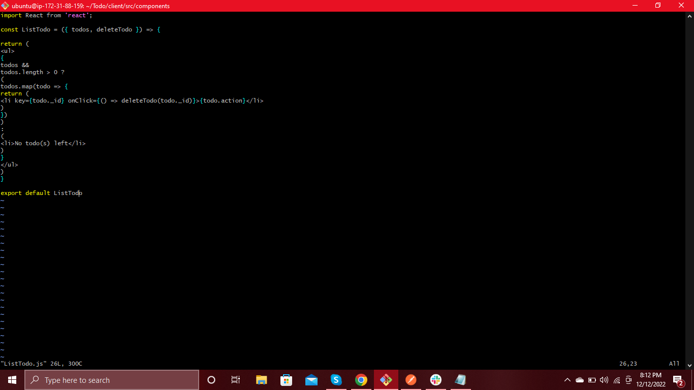

Open the __Todo.js__ file we copy and paste the following code:

```
import React, {Component} from 'react';
import axios from 'axios';

import Input from './Input';
import ListTodo from './ListTodo';

class Todo extends Component {

state = {
todos: []
}

componentDidMount(){
this.getTodos();
}

getTodos = () => {
axios.get('/api/todos')
.then(res => {
if(res.data){
this.setState({
todos: res.data
})
}
})
.catch(err => console.log(err))
}

deleteTodo = (id) => {

    axios.delete(`/api/todos/${id}`)
      .then(res => {
        if(res.data){
          this.getTodos()
        }
      })
      .catch(err => console.log(err))

}

render() {
let { todos } = this.state;

    return(
      <div>
        <h1>My Todo(s)</h1>
        <Input getTodos={this.getTodos}/>
        <ListTodo todos={todos} deleteTodo={this.deleteTodo}/>
      </div>
    )

}
}

export default Todo;
```
We then move into the __src__ directory:

```$ cd ..```

Open __App.js__ file:

```$ vim App.js```

Copy and paste the following codes into the file:

```
import React from 'react';

import Todo from './components/Todo';
import './App.css';

const App = () => {
return (
<div className="App">
<Todo />
</div>
);
}

export default App;
```

We __Exit__.

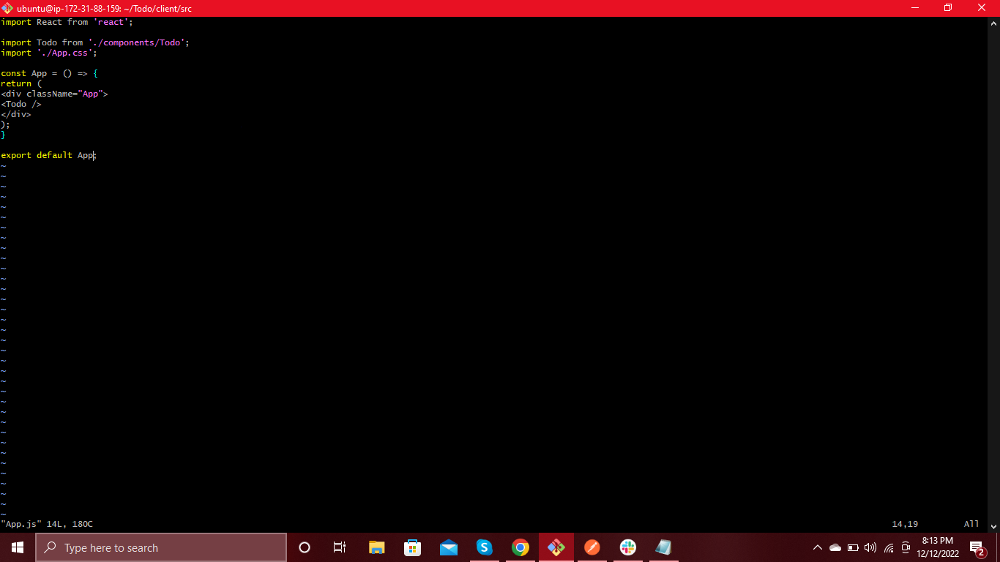

Next we open the __App.css__ file in the __src__ directory and paste the following codes:

```
.App {
text-align: center;
font-size: calc(10px + 2vmin);
width: 60%;
margin-left: auto;
margin-right: auto;
}

input {
height: 40px;
width: 50%;
border: none;
border-bottom: 2px #101113 solid;
background: none;
font-size: 1.5rem;
color: #787a80;
}

input:focus {
outline: none;
}

button {
width: 25%;
height: 45px;
border: none;
margin-left: 10px;
font-size: 25px;
background: #101113;
border-radius: 5px;
color: #787a80;
cursor: pointer;
}

button:focus {
outline: none;
}

ul {
list-style: none;
text-align: left;
padding: 15px;
background: #171a1f;
border-radius: 5px;
}

li {
padding: 15px;
font-size: 1.5rem;
margin-bottom: 15px;
background: #282c34;
border-radius: 5px;
overflow-wrap: break-word;
cursor: pointer;
}

@media only screen and (min-width: 300px) {
.App {
width: 80%;
}

input {
width: 100%
}

button {
width: 100%;
margin-top: 15px;
margin-left: 0;
}
}

@media only screen and (min-width: 640px) {
.App {
width: 60%;
}

input {
width: 50%;
}

button {
width: 30%;
margin-left: 10px;
margin-top: 0;
}
}
```

We __Exit__.

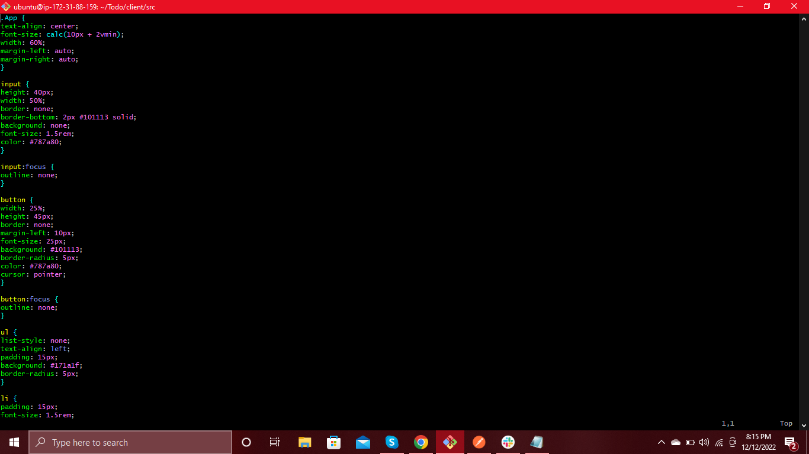

Still in the same  __src__ directory, we open the __index.css__ file:

```$ vim index.css```

We then copy and paste the following codes:

```
body {
margin: 0;
padding: 0;
font-family: -apple-system, BlinkMacSystemFont, "Segoe UI", "Roboto", "Oxygen",
"Ubuntu", "Cantarell", "Fira Sans", "Droid Sans", "Helvetica Neue",
sans-serif;
-webkit-font-smoothing: antialiased;
-moz-osx-font-smoothing: grayscale;
box-sizing: border-box;
background-color: #282c34;
color: #787a80;
}

code {
font-family: source-code-pro, Menlo, Monaco, Consolas, "Courier New",
monospace;
}
```
We go to the __Todo__ directory:

```$ cd ../..```

In the __Todo__ directory, we then run the command:

```$ npm run dev```

If there are no errors, there should be a message __"webfiles compiled successfully"__.

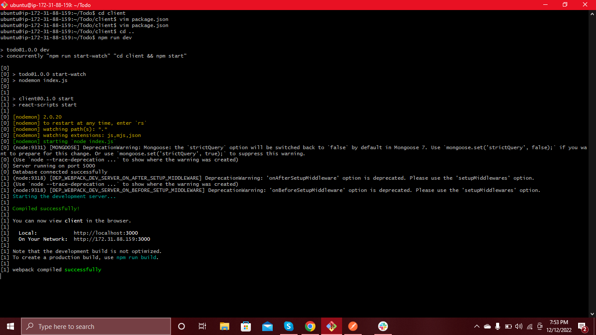


To view this on the browser, we past the URL:

```http://<PublicIP>:3000```

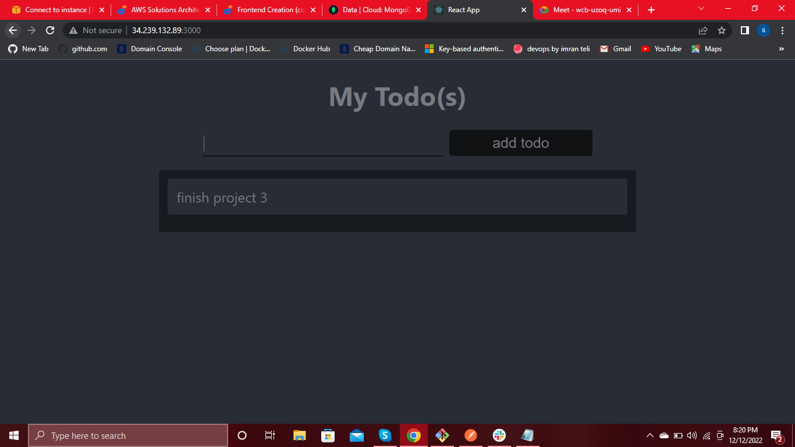

Our __To-do application__ is ready and functional with the functionality discussed earlier: creating a task, deleting a task and viewing all your tasks.


